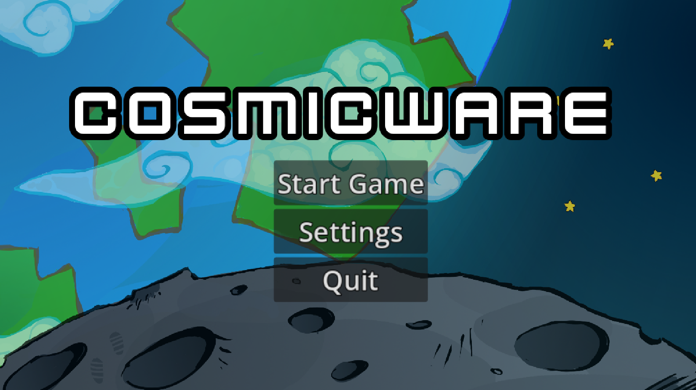
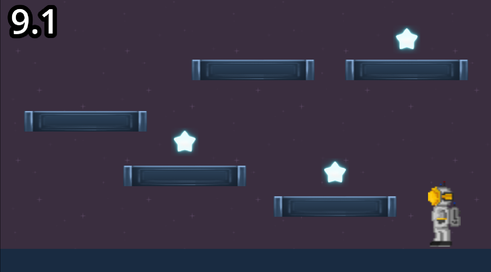
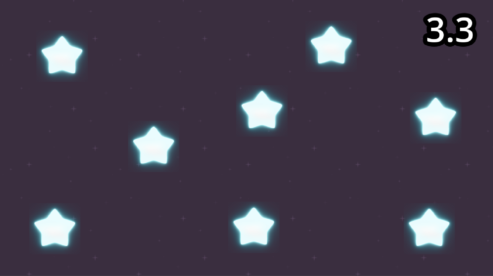
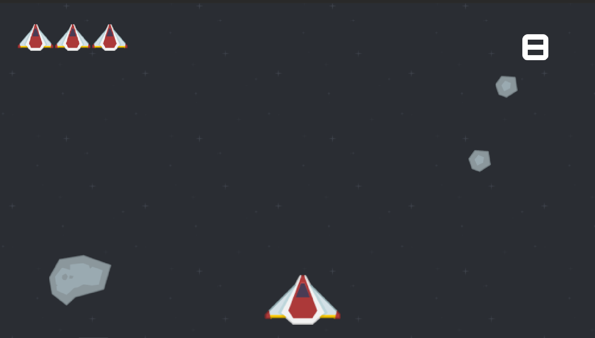

# CosmicWare

CosmicWare is a small space-themed minigame collection I made in Godot for Stardance.

## What's in the game

* Three space-themed minigames
* Three difficulty levels
* A shared lives system
* Timers for the minigames
* Sound effects
* A settings menu
* Web export

## Minigames

### Minigame 1

Collect 3 objects before the timer runs out.

### Minigame 2

Press 8 buttons as quickly as possible before time runs out.

### Minigame 3

Avoid the meteors and shoot them. Getting hit costs a ship, and you need to destroy enough meteors to finish the minigame.

## Built with

* Godot 4
* GDScript

## Running the game

Open the project in Godot 4 and run the project.

A web export is also included in the `exports` folder.

## Why I made it

I made CosmicWare as part of a Stardance mission. I added my own touches instead of keeping it stock.

I'm still working on improving the game by adding new stuff for the second level mission.
